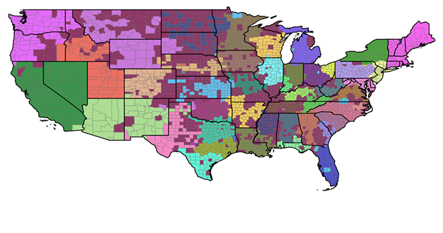
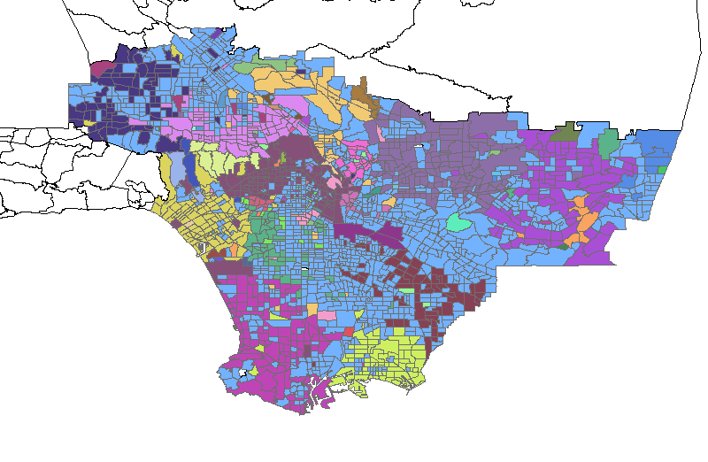

# place_connectivity index (PCI)

chekch the and [paper](https://arxiv.org/abs/2102.03991) and data [data](https://github.com/GIBDUSC/Place-Connectivity-Index).

This paper is the code (.ipynb) and results for agglomerative clustering in sk-learn.

Note: the distance matrix should be undirected!

Results:

50 cluster, linkage = 'average':




Note: the agglometrative clustering algorithm cannot process some of our datasets, so we develop a simple alternative 
to conduct bottom-up hierarchical clustering. Please check the code in `agglometrative_simple.py` file. This implementation is 
slow than `sk-learn`, and the result is not quite good, especially for small numbers of classes. However, it works on our datasets.

Usage:

Code example: `abels_all_rounds = sample_AgglomerativeClustering(dis_mat, conn_mat, n_cluster_list)`
```python
def sample_AgglomerativeClustering(dis_mat, conn_mat, n_cluster_list):
    '''
    Conduct agglomerative clustering. Reference: UPGMA (unweighted pair group method with arithmetic mean), https://en.wikipedia.org/wiki/UPGMA.
    :param dis_mat: precomputed distance matrix
    :param conn_mat: connectivity matrix
    :param n_cluster_list: a list of number of clusters
    :return: a list with cluster results, each element is a list of tuple (node.index, label).
    '''
```

Agglomerative clustering for Los Angeles census tracts.

Result from sk-learn.


Reuslt from this repository.



# Note:

In sk-learn, the distance matrix should be symmetrical (a = a.T), and has no isolated node! That is, in the connectivity 
matrix, every row and column should have a non-zero element at least!